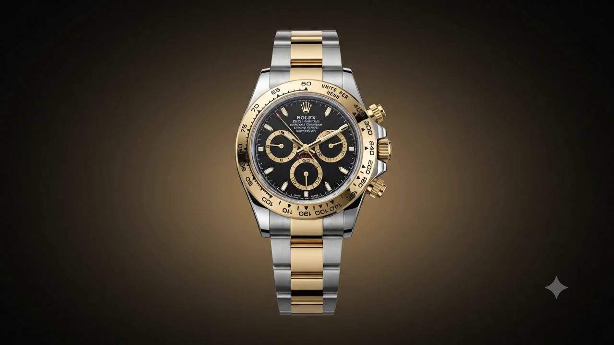
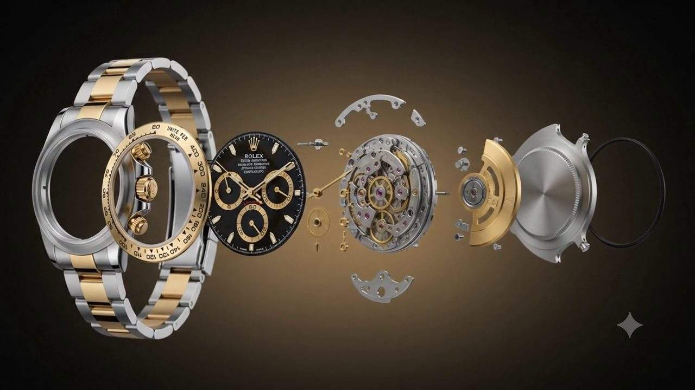
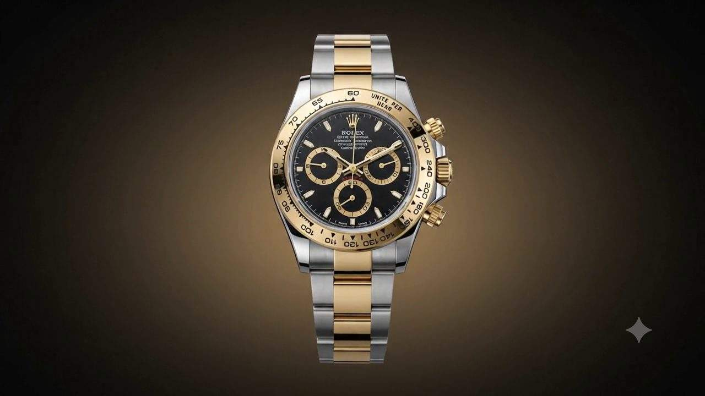

<div align="center">

<br />

<h1>— &nbsp; A U R I E N T &nbsp; —</h1>

<p><i>Scroll-Driven Animated Brand Page · MERN Stack Showcase</i></p>

<br />

[](https://react.dev)
[](https://vitejs.dev)
[](https://expressjs.com)
[](https://mongodb.com)
[](https://developer.mozilla.org/en-US/docs/Web/API/Canvas_API)
[](LICENSE)

<br />

**This is not a product. This is a demonstration.**  
A fully-functional, scroll-driven animated brand experience — showing what's possible when cinema-quality motion design meets the modern web stack.

<br />

</div>

---

## What Is This?

A premium animated brand page built for a **fictional luxury watch house — AURIENT Genève**. As the user scrolls, 240 individual video frames render on an HTML5 Canvas in real-time, creating the illusion of the watch **exploding into its components and reassembling** — all driven by the scroll position.

Think Apple's iPhone product pages. Applied to a luxury watch brand.

> **This repo is a showdown.** It demonstrates that animated, immersive brand experiences can be built on the open web — no WebGL, no Three.js, no expensive animation tools. Just React, Canvas, and clean engineering.

---

## Preview

| Assembled | Exploded View | Reassembled |
|:---------:|:-------------:|:-----------:|
|  |  |  |
| *Frame 0 — scroll begins* | *Frame 120 — full disassembly* | *Frame 239 — journey complete* |

---

## The Animation Engine

```
User scrolls ──► scroll progress (0→1)
                      │
                      ▼
            frameIndex = Math.floor(progress × 239)
                      │
                      ▼
        requestAnimationFrame → canvas.drawImage(frames[i])
                      │
                      ▼
        7 text phases sync to frame ranges (DOM direct write, zero React re-renders)
```

240 JPEG frames are preloaded on mount (first 30 priority, rest parallel). Every scroll event is wrapped in `requestAnimationFrame` with a ticking guard — the canvas never redraws more than 60fps regardless of scroll speed.

---

## Features

### Scroll-Driven Canvas Animation
- 240 frames rendered on `<canvas>` — cover-fit, always centred
- Scroll-progress mapped to frame index via `requestAnimationFrame`
- Sticky hero section: `height: calc(100vh + 5500px)` with `position: sticky` inner

### 7 Scroll-Synced Text Phases
Each phase fades in/out based on the current frame range — no timers, no GSAP:

| Phase | Frames | Content |
|-------|--------|---------|
| 0 | 0 – 38 | Brand reveal — AURIENT wordmark |
| 1 | 32 – 78 | "346 Components. One Movement." |
| 2 | 72 – 118 | "Every gear set by hand. 31 Rubies." |
| 3 | 112 – 152 | Calibre A-52 specs card |
| 4 | 146 – 188 | "Brought together in eleven weeks." |
| 5 | 182 – 222 | Founder's quote |
| 6 | 216 – 239 | Price + Reserve CTA |

### Light / Dark Theme
- CSS custom properties on `[data-theme]` — zero JS overhead for theme switch
- Persisted in `localStorage`
- Warm parchment (`#F5F0E8`) vs void black (`#080604`)

### UI Details
- **Custom cursor** — gold dot + elastic lagging ring (no CSS cursor, pure RAF loop)
- **Floating section nav** — dot indicators, hover labels, active state from IntersectionObserver
- **Animated counters** — 60 / 31 / 72h / 100 count up on scroll-in
- **Awards marquee** — infinite CSS animation strip
- **Heritage timeline** — horizontal scroll, 1963 → 2024, arrow navigation
- **Grain texture** — subtle SVG noise overlay

---

## Tech Stack

```
┌─────────────────────────────────────────────────────────┐
│  Frontend                    Backend                     │
│  ──────────                  ───────                     │
│  React 18 + Vite 5           Node.js + Express 4         │
│  HTML5 Canvas API            MongoDB + Mongoose           │
│  CSS Custom Properties       REST API + Static serving   │
│  IntersectionObserver        CORS + Cache headers        │
│  requestAnimationFrame       Fallback data (no DB req.)  │
└─────────────────────────────────────────────────────────┘
```

**No animation libraries.** No GSAP. No Framer Motion. No Three.js.  
Every transition is either CSS (`transition`, `animation`) or a `requestAnimationFrame` loop — keeping the bundle lean and the performance ceiling high.

---

## Quick Start

### Prerequisites
- Node.js >= 18
- Python 3 + Pillow (`pip install Pillow`)
- Your source frame ZIP (the 240 PNG frames)
- MongoDB (optional — app runs fully without it)

### 1. Clone
```bash
git clone https://github.com/Zephyrex21/frame-scroll-showcase.git
cd frame-scroll-showcase
```

### 2. Generate frames
```bash
python3 setup_frames.py /path/to/your/frames.zip
```
Converts source PNGs to progressive JPEGs (~15MB total) and places them in `backend/public/frames/`.

### 3. Install & run
```bash
npm install          # installs concurrently at root
npm run install:all  # installs backend + frontend dependencies
npm run dev          # starts both servers concurrently
```

| Service | URL |
|---------|-----|
| Frontend | http://localhost:5173 |
| Backend API | http://localhost:5000/api/watch |
| Frames | http://localhost:5000/frames/frame_00000.jpg |

### 4. (Optional) Seed MongoDB
```bash
cd backend && npm run seed
```

---

## Project Structure

```
frame-scroll-showcase/
│
├── docs/                          # Preview images for README
│   ├── preview-hero.jpg
│   ├── preview-exploded.jpg
│   └── preview-final.jpg
│
├── backend/
│   ├── server.js                  # Express + static frame serving
│   ├── models/Watch.js            # Mongoose schema
│   ├── routes/api.js              # REST endpoints + fallback data
│   ├── data/seed.js               # MongoDB seeder
│   └── public/frames/             # generated by setup_frames.py (gitignored)
│
├── frontend/
│   ├── index.html
│   ├── vite.config.js             # Proxy /api + /frames to backend
│   ├── vercel.json                # Production rewrites for Vercel deployment
│   └── src/
│       ├── App.jsx                # Theme state, data fetching
│       ├── index.css              # Design tokens, light/dark vars
│       └── components/
│           ├── Cursor.jsx         # Custom gold cursor
│           ├── SectionNav.jsx     # Floating dot nav
│           ├── Navbar.jsx         # Theme toggle + brand
│           ├── Hero.jsx           # The 240-frame scroll engine
│           ├── Awards.jsx         # Infinite marquee strip
│           ├── Introduction.jsx   # Animated counters
│           ├── Specs.jsx          # Technical specifications
│           ├── Heritage.jsx       # Horizontal timeline
│           ├── Movement.jsx       # Exploded view section
│           ├── Materials.jsx      # Materials alternating layout
│           ├── CTA.jsx            # Private enquiry form
│           └── Footer.jsx
│
├── setup_frames.py                # One-time frame processor
├── package.json                   # Root — runs both servers via concurrently
├── .gitignore
└── README.md
```

---

## API Endpoints

| Method | Route | Description |
|--------|-------|-------------|
| `GET` | `/api/health` | Server status |
| `GET` | `/api/watch` | Featured watch data |
| `GET` | `/api/frames/meta` | Frame count & format |
| `POST` | `/api/enquiry` | Submit enquiry |

The app ships with **complete fallback data** — if MongoDB is not running, the entire site works without a database connection.

---

## Design System

| Token | Light | Dark | Usage |
|-------|-------|------|-------|
| `--bg-void` | `#F5F0E8` | `#080604` | Page background |
| `--gold` | `#9A7230` | `#C9973A` | Primary accent |
| `--ivory` | `#1A140E` | `#EAE2D2` | Primary text |
| `--ivory-muted` | `#6E5E46` | `#9A8E7A` | Secondary text |
| `--font-display` | Cormorant Garamond | — | Headings |
| `--font-body` | DM Sans | — | Body copy |
| `--font-mono` | Space Mono | — | Labels & specs |

---

## Can I Build This For My Brand?

Yes. This architecture works for **any product** with a sequence of frames — a car, a sneaker, a perfume bottle, a phone. The stack is intentionally minimal so it can be adapted quickly.

What you bring:
- Your brand's video or animation exported as PNG frames (ideally 120–300 frames at 24fps)
- Your brand identity (colours, typography, copy)

What this repo provides:
- The entire scroll engine, text-phase system, and site structure
- Ready to clone, adapt, and deploy

---

## Performance Notes

| Metric | Value |
|--------|-------|
| Frame files | 240 x ~60KB JPEG |
| Total frame payload | ~15MB |
| First frame visible | < 1s (priority preload) |
| Scroll frame update | Capped at 60fps via RAF |
| React re-renders on scroll | **Zero** (text phases via direct DOM) |
| Bundle size (est.) | ~180KB gzip |

---

## License

MIT — use it, fork it, build on it. See [LICENSE](LICENSE).

---

<div align="center">

Built with precision · Crafted for the web

*Every frame tells a story. Every scroll reveals a truth.*

</div>
